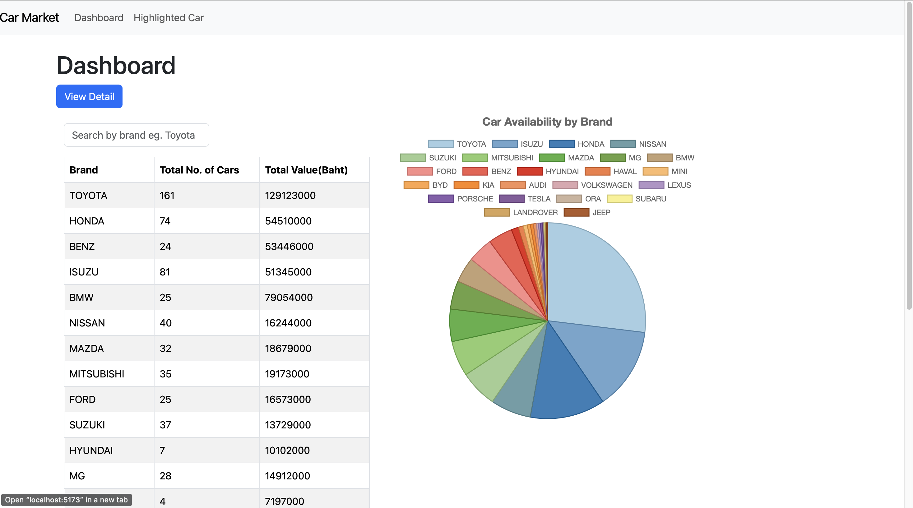
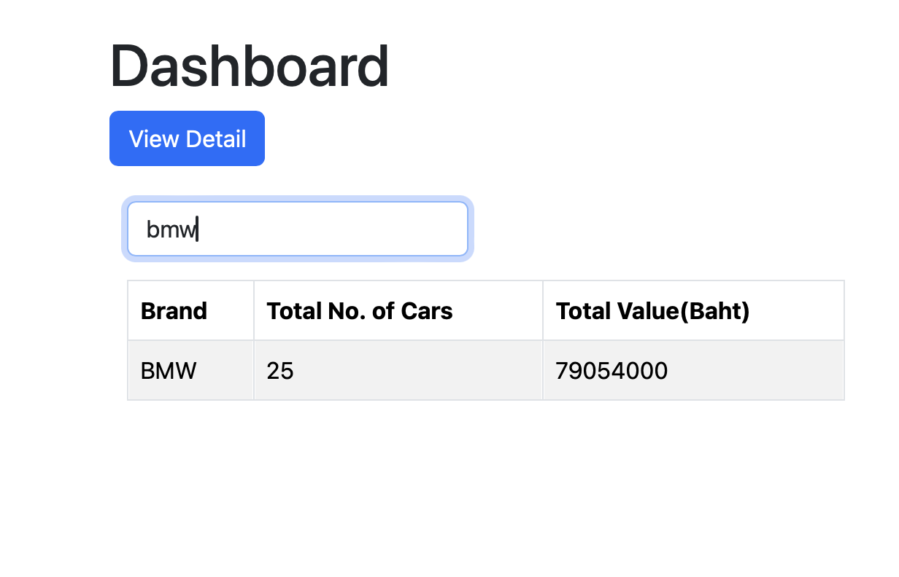
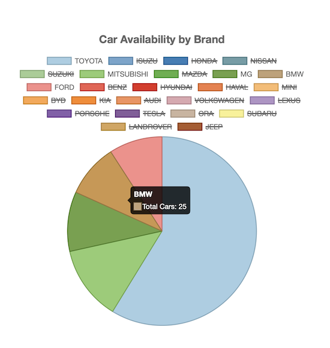
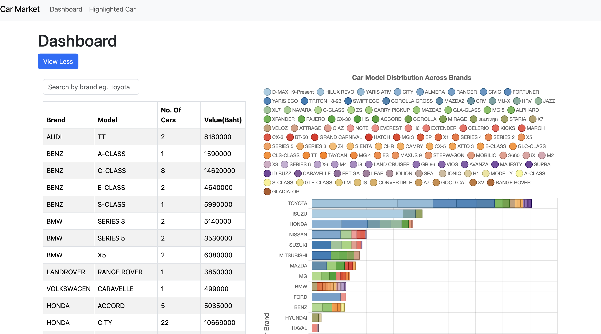
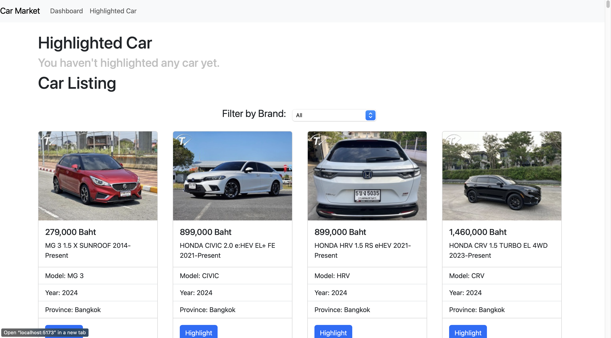
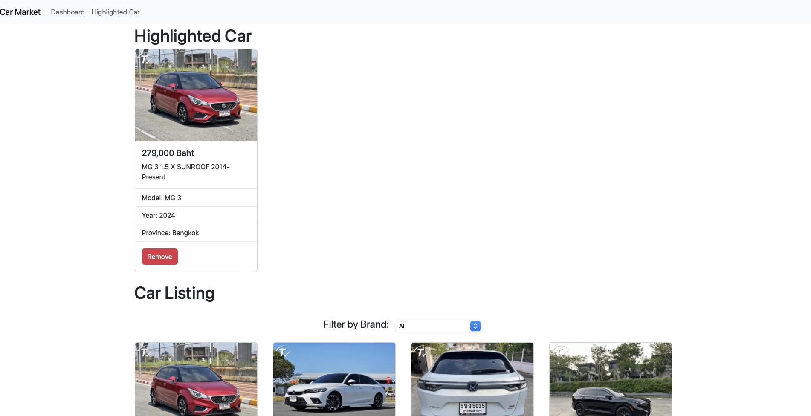
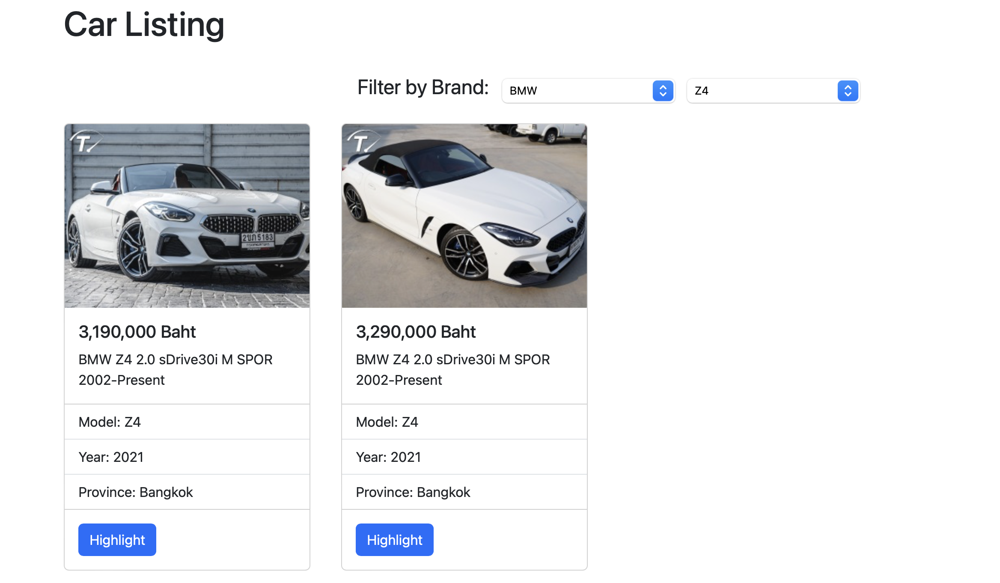

# Project: Car Market Analytics

# Members
Sai Aik Sei Mouk https://github.com/SaaiLeo/SaaiLeo.github.io  
Sai Thaw Zin Aung https://github.com/Aris823/Aris823.github.io.git  
Yel Lin https://github.com/Yellin21/yellin21.github.io 

# Description
In this project, we build a web application for car market analytics. The data is from taladrod-cars.(https://www.taladrod.com/w40/home/).

In our web application

# First page (Dashboard)

User can find a general dashboard. On the Left, we have a table showing how many cars we have based on car brand and their total value in Baht.
On the Right, we have a pie chart showing the proportions of each car brand.

User can also filter/search by car brand in the search box.

Or user can click the legend to remove the car brand user are not interested in. Therefore, leaving only those user are interesting in.

By clicking "View Detail" button, the table will include model. No. of cars and Value is calculated based on not only Brand but also Model.
Stacked Horizontal Bar chart will be shown instead of pie chart in order to allow user to see in dept details. User can change back to pie chart by simply clicking "View Less" button. Search filter and legend filter also work in here.  

# Second Page (Highlighted Car)
In our Highlighted Car page user can Highlight car from Car Listing. After Highlighted a car, that car will be pinned on the top of Car Listing. User can remove(unpin) car from both Highlighted Car and Car Listing. These highlighted Car will persist even when user close the tab.  

User can filter by selecting brand and model too.

